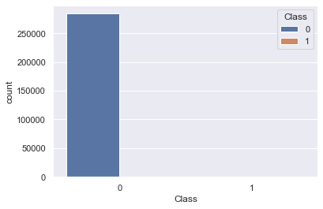
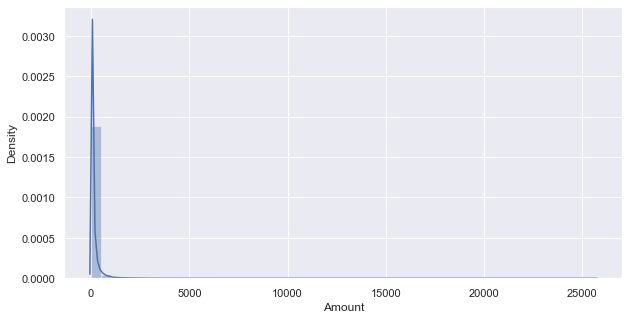
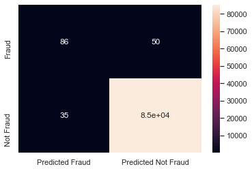
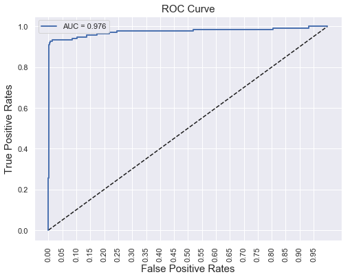
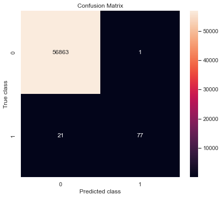

# Credit Card Fraud Detection

A machine learning project that detects fraudulent credit card transactions using classic classification algorithms — Logistic Regression, Support Vector Machines, Naive Bayes, K-Means, K-Nearest Neighbors, and Random Forest — on a highly imbalanced, real-world transaction dataset.



## 📌 Overview

Credit card fraud costs banks and consumers billions of dollars every year, and fraudulent transactions make up a vanishingly small fraction of all transactions. That imbalance is what makes this problem interesting: a model that predicts "not fraud" every single time would still be ~99.8% accurate — and completely useless. This project walks through the full workflow of tackling that challenge:

- Exploratory data analysis on a highly imbalanced dataset
- Feature engineering (binning transaction amounts)
- Training and comparing multiple ML algorithms
- Hyperparameter tuning (SVM kernels via `RandomizedSearchCV`)
- Evaluating models with metrics that actually matter for imbalanced data (precision, recall, F1, AUC — not just accuracy)

## 📂 Repository Contents

| File | Description |
|---|---|
| `Credit_Card_Fraud_Detection.ipynb` | The main Jupyter notebook containing the full analysis, modeling, and evaluation |
| `creditcard.csv` | The dataset (see below) |
| `README.md` | This file |

> **Note:** This repo previously contained two exploratory notebooks. They have been consolidated into a single, more complete notebook — see [Notebook Consolidation](#-notebook-consolidation) below for details on that decision.

## 📊 Dataset

The dataset contains transactions made by European cardholders over two days in September 2013. It has **284,807 transactions**, of which only **492 are fraudulent** (~0.17%).

- 28 features (`V1`–`V28`) are the result of a PCA transformation, applied for confidentiality reasons
- `Time` — seconds elapsed between each transaction and the first transaction in the dataset
- `Amount` — transaction amount
- `Class` — target variable (`1` = fraud, `0` = legitimate)

Because the original features are PCA components, there's no raw feature-level interpretability (e.g., "merchant category" or "location") — the modeling challenge is purely about handling scale and extreme class imbalance well.

*Dataset originally released by the [Machine Learning Group at ULB](https://www.kaggle.com/mlg-ulb/creditcardfraud) on Kaggle.*

## 🔍 Exploratory Data Analysis

The notebook starts by confirming just how imbalanced the data is, and looking at how transaction amounts are distributed.

<p float="left">
  
  
</p>

The vast majority of transactions — fraudulent or not — fall well under €2,854, with a long tail of larger amounts. This informed a feature engineering step where `Amount` is bucketed into bins and one-hot encoded before modeling.

## 🤖 Models Trained

The notebook trains and evaluates the following algorithms, in order of increasing complexity:

1. **Logistic Regression** — baseline linear model, also tested with 2nd-degree polynomial features
2. **Support Vector Machine (SVM)** — trained on Min-Max scaled features, then tuned across `rbf`, `sigmoid`, and `linear` kernels using `RandomizedSearchCV`
3. **Naive Bayes (Gaussian)** — fast probabilistic baseline
4. **K-Means Clustering** — unsupervised approach repurposed for a binary classification comparison
5. **K-Nearest Neighbors (KNN)**
6. **Random Forest Classifier** — ensemble method, generally the strongest performer

### Why not just look at accuracy?

Because fraud is so rare, accuracy is misleading — a model can score >99% while catching almost no fraud. Instead, the notebook focuses on:

- **Precision** — of the transactions flagged as fraud, how many actually are?
- **Recall** — of all the actual fraud, how much did the model catch?
- **F1-Score** — the balance between precision and recall
- **AUC-ROC** — how well the model separates the two classes across all thresholds



## 📈 Results

| Model | Accuracy | Precision | Recall | F1-Score | AUC |
|---|---|---|---|---|---|
| Logistic Regression | 99.90% | 71.07% | 63.24% | 66.93% | 0.934 |
| SVM (linear kernel) | 99.94% | 83.21% | 80.15% | 81.65% | 0.901 |
| SVM (tuned, RBF kernel) | — | — | 83.09% | — | ~0.97 |
| Naive Bayes | 99.30% | 14.11% | 66.18% | 23.26% | 0.828 |
| Random Forest | 99.96% | 98.72% | 78.57% | 87.50% | — |

*(Metrics pulled directly from the executed notebook outputs. A few cells in the K-Means/KNN/Random Forest section reuse variable names between models — worth double-checking if you re-run and rely on those exact figures.)*

**Random Forest** comes out on top on precision and F1-score, meaning it flags fraud confidently without too many false alarms. The **tuned SVM (RBF kernel)** achieves the best recall/AUC trade-off, catching more actual fraud cases at the cost of a few more false positives. Which one you'd deploy in practice depends on whether your priority is minimizing false alarms (Random Forest) or catching as much fraud as possible (tuned SVM) — a classic precision/recall trade-off in fraud detection.




## 🛠️ Tech Stack

- Python 3
- `pandas`, `numpy` — data manipulation
- `matplotlib`, `seaborn` — visualization
- `scikit-learn` — modeling, metrics, and hyperparameter tuning

## 🚀 Getting Started

1. Clone this repo:
   ```bash
   git clone https://github.com/<your-username>/Credit-Card-Fraud-Detection.git
   cd Credit-Card-Fraud-Detection
   ```
2. Install dependencies:
   ```bash
   pip install pandas numpy matplotlib seaborn scikit-learn jupyter
   ```
3. Make sure `creditcard.csv` is in the same directory as the notebook.
4. Launch the notebook:
   ```bash
   jupyter notebook Credit_Card_Fraud_Detection.ipynb
   ```

## 📝 Notebook Consolidation

This repo originally had two notebooks covering very similar ground. After reviewing both in detail:

- **Notebook 1** (kept, now `Credit_Card_Fraud_Detection.ipynb`) has the most complete modeling coverage — it's the only one with a full SVM hyperparameter search across three kernels — plus more thorough step-by-step markdown explanations, and no faulty aggregate results table.
- **Notebook 2** (removed) had some nice extra preprocessing touches (duplicate removal, a correlation heatmap, SMOTE-based class balancing) but its final model-comparison table reused variable names between the Naive Bayes and Random Forest sections, making some of its reported numbers unreliable, and it dropped the SVM section entirely.

Rather than maintain two overlapping, partially-buggy notebooks, they've been consolidated into one. If you'd like, the duplicate-removal and SMOTE-balancing ideas from Notebook 2 would be a great addition to bring back into the kept notebook as a follow-up improvement.

## 🔮 Future Improvements

- Balance the training data with SMOTE or class weighting and compare against the current (unbalanced) results
- Try gradient-boosted models (XGBoost, LightGBM)
- Build a simple inference script / API for scoring new transactions
- Track experiments with something like MLflow for cleaner model comparison

## 📄 License

Add your preferred license here (e.g., MIT).
