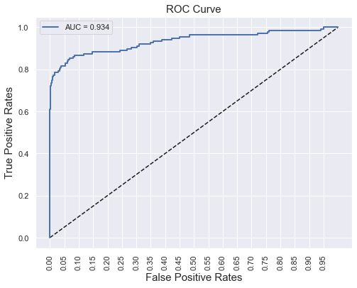

# Credit Card Fraud Detection

A machine learning project that detects fraudulent credit card transactions using classic classification algorithms — Logistic Regression, Naive Bayes, K-Nearest Neighbors, Random Forest, and Support Vector Machines — on a highly imbalanced, real-world transaction dataset.


## 📌 Overview

Credit card fraud costs banks and consumers billions of dollars every year, and fraudulent transactions make up a vanishingly small fraction of all transactions. That imbalance is what makes this problem interesting: a model that predicts "not fraud" every single time would still be ~99.8% accurate — and completely useless. This project walks through the full workflow of tackling that challenge:

- Exploratory data analysis on a highly imbalanced dataset
- Feature engineering (binning transaction amounts)
- Training and comparing multiple ML algorithms
- Hyperparameter tuning (SVM kernels via `RandomizedSearchCV`)
- Evaluating models with metrics that actually matter for imbalanced data (precision, recall, F1, AUC — not just accuracy)

## 📂 Repository Contents

| File | Description |
|---|---|
| `Credit_Card_Fraud_Detection.ipynb` | The main Jupyter notebook — full analysis, modeling, and evaluation |
| `Credit_Card_Fraud_Detection_Research_Paper_(Anshika_Gupta).pdf` | An accompanying academic write-up of this project, covering related work, methodology, and results in paper format |
| `images/` | Charts referenced in this README |
| `README.md` | This file |

> The dataset itself (`creditcard.csv`) is **not** stored in this repo — it's too large for GitHub. See below for where to get it.

## 📊 Dataset

**Download:** [Credit Card Fraud Detection dataset on Kaggle](https://www.kaggle.com/mlg-ulb/creditcardfraud)

The dataset contains transactions made by European cardholders over two days in September 2013. It has **284,807 transactions**, of which only **492 are fraudulent** (~0.17%).

- 28 features (`V1`–`V28`) are the result of a PCA transformation, applied for confidentiality reasons
- `Time` — seconds elapsed between each transaction and the first transaction in the dataset
- `Amount` — transaction amount
- `Class` — target variable (`1` = fraud, `0` = legitimate)

Because the original features are PCA components, there's no raw feature-level interpretability (e.g., "merchant category" or "location") — the modeling challenge is purely about handling scale and extreme class imbalance well.

Download `creditcard.csv` from the Kaggle link above and place it in the same folder as the notebook before running it.

*Dataset originally released by the [Machine Learning Group at ULB](https://www.kaggle.com/mlg-ulb/creditcardfraud).*

## 🔍 Exploratory Data Analysis

The notebook starts by confirming just how imbalanced the data is, and looking at how transaction amounts are distributed.

<p float="left">
  
  
</p>

The vast majority of transactions — fraudulent or not — fall well under €2,854, with a long tail of larger amounts. This informed a feature engineering step where `Amount` is bucketed into bins and one-hot encoded before modeling.

## 🤖 Models Trained

The notebook trains and evaluates the following algorithms, in order of increasing complexity:

1. **Logistic Regression** — baseline linear model, also tested with 2nd-degree polynomial features
2. **Support Vector Machine (SVM)** — trained on Min-Max scaled features, then tuned across `rbf`, `sigmoid`, and `linear` kernels using `RandomizedSearchCV`
3. **Naive Bayes (Gaussian)** — fast probabilistic baseline
4. **K-Means Clustering** — unsupervised approach repurposed for a binary classification comparison
5. **K-Nearest Neighbors (KNN)**
6. **Random Forest Classifier** — ensemble method

### Why not just look at accuracy?

Because fraud is so rare, accuracy is misleading — a model can score >99% while catching almost no fraud. Instead, this project focuses on:

- **Precision** — of the transactions flagged as fraud, how many actually are?
- **Recall (Sensitivity)** — of all the actual fraud, how much did the model catch?
- **F1-Score** — the balance between precision and recall
- **AUC-ROC** — how well the model separates the two classes across all thresholds

Of these, **recall** matters most here: a missed fraud case (false negative) is generally more costly than a false alarm (false positive), so models are compared with an eye toward maximizing recall without destroying precision.


## 📈 Results

*(as reported in the accompanying research paper, based on this notebook's models — 70/30 train-test split)*

| Model | Accuracy | Sensitivity (Recall) | Specificity | Precision | F1 Score | AUC |
|---|---|---|---|---|---|---|
| **Logistic Regression** | 98.83% | **86.03%** | 98.85% | 10.98% | 19.47% | 95.36% |
| Naive Bayes | 99.30% | 66.18% | 99.36% | 14.11% | 23.26% | 82.77% |
| K-Nearest Neighbors | 99.92% | 68.09% | 99.98% | 82.05% | 74.42% | 84.03% |
| Random Forest | 99.95% | 79.41% | 99.98% | 87.10% | 83.08% | **95.71%** |
| SVM | 99.94% | 80.15% | 99.97% | 83.21% | 81.65% | 90.06% |

<p float="left">
  
  
</p>

**Logistic Regression** achieves the highest recall by a wide margin — catching the most actual fraud cases — but at the cost of very low precision (lots of false alarms). **Random Forest** offers the best overall balance, with the highest precision, F1-score, and AUC. Which one you'd deploy in practice depends on your priority: catching as much fraud as possible even with more false positives (Logistic Regression), or a more balanced, confident flagging system (Random Forest).


## 📄 Research Paper

This repo includes `Credit_Card_Fraud_Detection_Research_Paper_(Anshika_Gupta).pdf`, an unpublished academic write-up of this project completed as coursework at The NorthCap University. It covers related work from other published fraud-detection studies, a fuller methodology section (including Borderline-SMOTE for class balancing), and a formal results comparison across all five models — worth a read if you want more context beyond the notebook itself.

## 🛠️ Tech Stack

- Python 3
- `pandas`, `numpy` — data manipulation
- `matplotlib`, `seaborn` — visualization
- `scikit-learn` — modeling, metrics, and hyperparameter tuning

## 🚀 Getting Started

1. Clone this repo:
   ```bash
   git clone https://github.com/<your-username>/Credit-Card-Fraud-Detection.git
   cd Credit-Card-Fraud-Detection
   ```
2. Install dependencies:
   ```bash
   pip install pandas numpy matplotlib seaborn scikit-learn jupyter
   ```
3. Download `creditcard.csv` from [Kaggle](https://www.kaggle.com/mlg-ulb/creditcardfraud) and place it in the repo folder, alongside the notebook.
4. Launch the notebook:
   ```bash
   jupyter notebook Credit_Card_Fraud_Detection.ipynb
   ```

## 🔮 Future Improvements

- Balance the training data with SMOTE / Borderline-SMOTE or class weighting and compare against the current (unbalanced) results
- Try gradient-boosted models (XGBoost, LightGBM)
- Build a simple inference script / API for scoring new transactions
- Track experiments with something like MLflow for cleaner model comparison

## 📄 License

Add your preferred license here (e.g., MIT).
